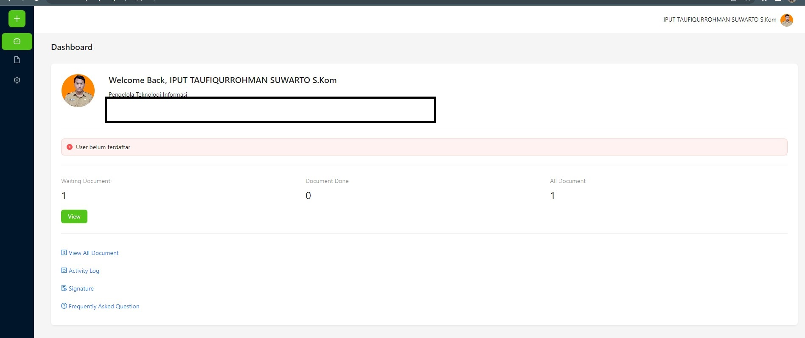

# E-Sign (WIP)
Aplikasi Tanda Tangan Elektronik BKD Jatim. Integrasi dengan BSrE dan menggunakan SSO Kepegawaian. 

# Framework
- NextJS
- Prisma
- NextAuth
- Canvas
- Antd

# Fitur
- Upload dan tanda tangan secara mandiri
- Meminta tanda tangan dan review ke pegawai/staff lain
- Drag and drop stempel tanda tangan + tambah hapus tanda tangan di dokumn

# Alamat
[Aplikasi E-Sign](siasn.bkd.jatimprov.go.id/esign)

